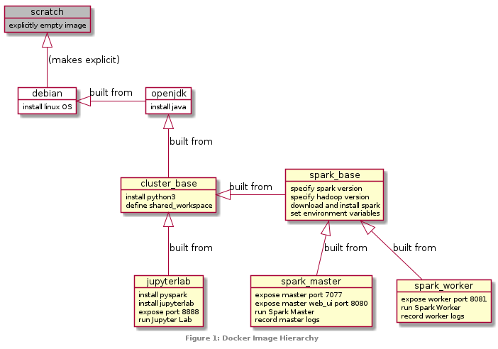
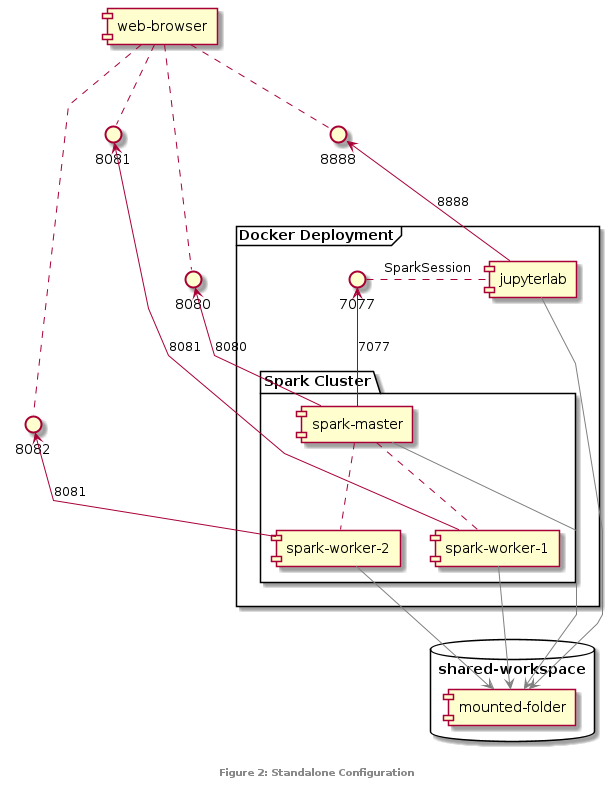

# Big Data Analysis using Spark

This is my project file for Assignment 1 of [COMP529](https://intranet.csc.liv.ac.uk/teaching/modules/module.php?code=COMP529), which  requires the configuration of a Spark standalone cluster, and then the implementation of some specified data analysis on a table of coronavirus data (see [task description](./files/A1.pdf)).

The cluster configuration is done using Docker, so setting it up on your own machine should be as simple as this:
```
git clone https://github.com/peterprescott/spark-standalone
cd spark-standalone
docker-compose up
```

This will pull the necessary pre-built images from my Docker Hub. Alternatively, you can build them yourself. Change the `BUILDER` variable in the .env file to your own Docker username, and then:
```
cd docker
bash build.sh
```

The Dockerfiles are based on the excellent example of [André Perez](https://towardsdatascience.com/apache-spark-cluster-on-docker-ft-a-juyterlab-interface-418383c95445): the details of their relationship are shown in Figure 1.



One you launch the cluster with `docker-compose up`, you can open your web-browser and confirm everything is running by checking the Spark Master UI at [localhost:8080](localhost:8080)



You can then open the Jupyter Lab interface at [localhost:8888](localhost:8888), find the `spark-analysis.ipynb` notebook in the `nb` file, and run through the code. The data flow process is shown in Figure 3.


The diagrams here have been generated from text using PlantUML.
