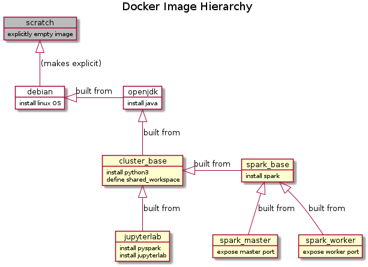
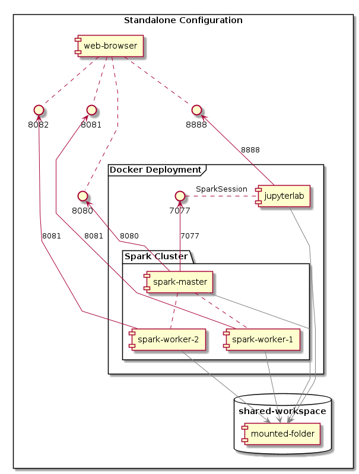
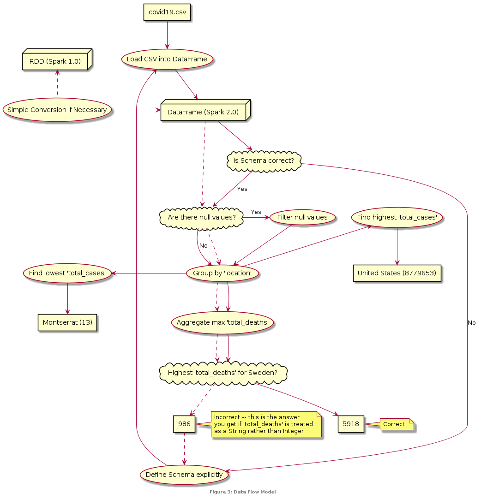

# Introduction

Recent years have witnessed a *data revolution* characterised by unprecedented volume, variety and velocity [@RKitchin2014]. The challenge of handling such quantities of data has led to the development of a series of new technologies: the *MapReduce* paradigm for distributed data processing [@JDeanGhemawat2008], the *Hadoop* Distributed File System  for storing and streaming such data [@KShvachkoEtAl2010], the *Spark* Resilient Distributed Dataset for in-memory cluster computing [@MZahariaEtAl2012], and the Spark SQL module, which extends Spark with an optimized relational *Dataframe* API [@MArmbrustEtAl2015].

For this assignment [@BAmen2020], I am required to describe the middleware configuration of a Spark standalone cluster, to perform some simple analysis on a Spark Dataframe created from a CSV containing coronavirus data, and to present the results in a report of two A4 pages of 12-point text.

# Middleware Configuration

Docker [@CBoettiger2015]

# Data Analytic Design

# Results and Discussion

# Conclusions and Recommendations

# References
